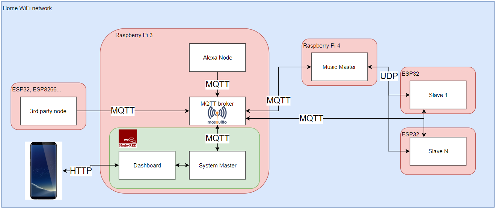
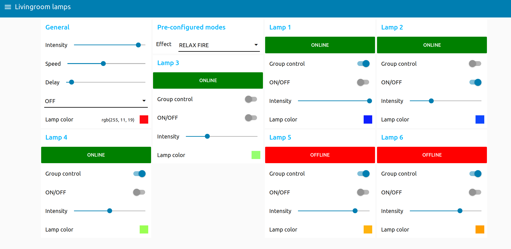
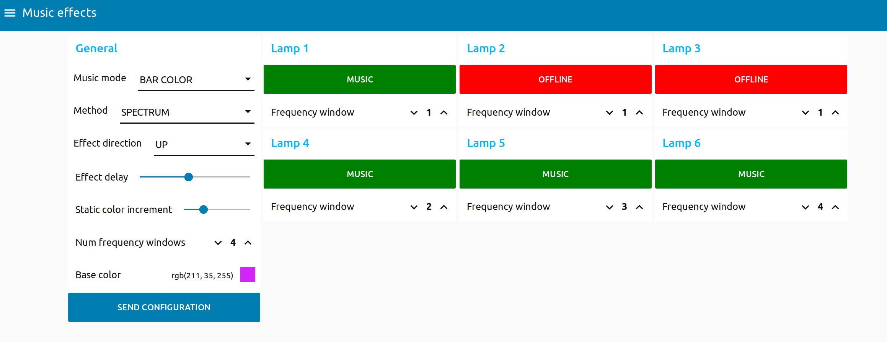
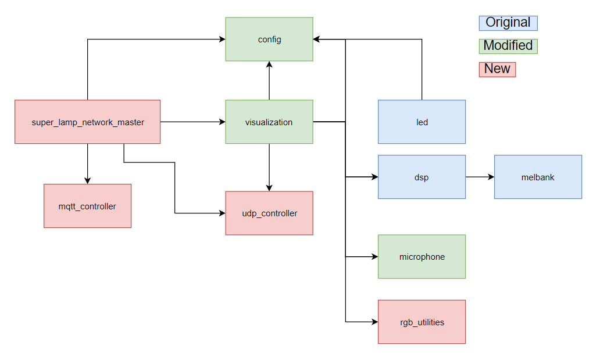

# Super Lamp Network Project
## Introduction
Sound-reactive music effects is a well tackled project. A quick search in Google shows many different solutions, some better focused on the effects, some others better focused on the signal processing.
I have even created myself a sound reactive lamp a year ago with just an Arduino, a led stripe and a microphone.
But an important part that I miss in all the projects is the real life usability. Sure you will show all your friends your new lights and you may as well enjoy them once in a while with some music, but 99% of the time, you won't be using the music effects.
I am also a home-automation fan, so I would like that the lamps could also communicate with my home automation setup, so that they switch on automatically when arriving home, switch off when going to bed, be Alexa-compatible...
Finally, it would not make sense to have one super cool smart-lamp and other non-smart lights in the same room... then what is the automation for? If you need more than one lamp to light your room, then all the lamps should be of the same type.

There are two different system-level architectures to tackle this project:
a) Each lamp receives basic commands (mode switch, color...) and processes locally the audio signal. The system requires 1 System Master and N Slaves (lamps).
b) Each lamp receives basic commands and processed audio information (translated to color and amplitude). The system requires 1 System Master, 1 Music Master and N Slaves (lamps).

Option A would be cheaper for a small number of lamps and more expensive for large number of lamps, and it would require less configuration and effort than option B.
Nevertheless, processing the signal at one single point and then sharing this information to all the lamps allows a better quality of music effects. The information (color,amplitude...) displayed by each lamp will be the same (except in case of network losses).

Putting all these ideas together, the requirements and goals of this project would be:
* The system shall consist of one or more lamps.
* The lamps may be controlled independently or all together.
* The system is easily scalable, new lamps can be added/removed with (almost) no additional effort*.
* The lamps can work independently from each other. Unplugging one lamp should not affect the others.
* The lamps shall have a music-reactive mode.
* In music mode, all lamps shall be synchronized and react to the same audio signal.
* The system shall be compatible to receive commands from 3rd party systems (e.g: home automation setup, Alexa...).

## System architecture
The system will consist of 1 System Master, 1 Music Master and N Slaves.
System Master and Music Master can be deployed on the same machine or on separate ones.
All the components must be connected to the same local network.

## System functionality
This section explains what the system can do from the user point of view. A more detailed explanation of why and how is done in the next sections.

### Standard functionality
In 99% of the cases, the slaves will be used as normal lamps. There are 3 standard functionality modes defined:
* In OFF mode, the leds are simply shut down.
* In ON mode, the leds display a constant RGB value. The default value can be configured in the Slave source code (config.h). In this mode, the color (RGB) and intensity (as well as ON/OFF switch) can be changed from the dashboard or from third party events if desired (see MQTT communication description). All these modifications can be done either to each slave independently or to a group of slaves.
* In AMBIENT_LIGHT mode, the light intensity will vary depending on the ambient light: it will switch ON smoothly when the ambient light decreases.

### Static effects functionality
A group of slaves can be configured to display a hard-coded effect that will only depend on its configuration parameters.
The configuration parameters of any effect can be modified at any time (before and during the execution of the effect).
The effects are executed continuously until another mode is requested.
Not all effects depend on all those parameters, and for some effects, a right parameter is mandatory. The following table shows the current available effects and their parameters:

| Effect name |	Parameter	|
| ------------ |------------ |
| RGB loop | **Lamp color**: base color for the fade effect |
| Fade in out | - |
| Strobe | **Speed**: toggle frequency for a sequence of 50 toggles   **Delay**: delay between sequences   **Lamp color**: color |
| Fire | **Speed**: speed of the fire |
| Haloween eyes | Effect in development |
| Cyclon bounce | **Speed**: speed of the bar   **Delay**: delay between repetitions   **Lamp Color**: bar color |
| Twinkle | **Speed**: duration time of each point   **Lamp Color**: color of the point |
| Twinkle random | **Speed**: duration time of each point |
| Sparkle | **Speed**: generation/removal speed of the points   **Lamp Color**: color of (new) points |
| Snow sparkle | **Speed**: duration time of each point   **Delay**: delay between generation/removal of points   **Lamp Color**: background color |
| Running lights | **Speed**: shifting speed   **Lamp Color**: color of the bars |
| Color wipe | Effect in development |
| Rainbow cycle | **Speed**: shifting speed of the rainbow |
| Theater chase | Effect in development |
| Theater chase rainbow | Effect in development |
| Bouncing balls | **Delay**: IMPORTANT: this is the starting number of balls and also the maximum. This value must be set before entering this mode and may only be reduced within. You may exit the mode, increase the value and enter back again. Tested only with up to 20 balls.   **Lamp Color**: base color to generate ball colors |
| Meteor rain | Effect in development |
| Fade to black | Effect in development |

Most of these effects are based on the third party effect library (see third party libraries) but refactored in an "asynchronous blynk" style to avoid blocking calls. For a better description of the effect, see the original library (or just try it out!)

### Music effects functionality
A group of slaves can be configured to display a light effect that will depend on its configuration parameters and music-color information provided by the Music Master.
The configuration parameters of any effect can be modified at any time (before and during the execution of the effect). A small delay between sending a configuration change and its application in the slaves may be noticed (see communication description).
The effects are executed continuously until another mode is requested.
The slaves provide three different effects to display the music information. Furthermore, the Music Master provides three different methods to generate light information out of audio signal.
All effects are compatible with all methods, leaving us with 9 possible effect-method combinations. Each combination will be more suitable to different types of music.

Here is a short description of how a method generates color information, how it looks like with different effects, and how the overall result is affected by the configuration parameters.
The configuration parameters are:
* Effect delay: the update frequency (in ms) of the LED stripe. It includes the evaluation of a new color payload message, computing effect parameters, and displaying the LEDs. The lower the delay, the faster a new message is evaluated and the more "responsive" the system seems to be. Updating the effect faster than the payload message rate would make no sense, so here I would not recommend a delay lower than 20ms (but depends on the performance of the Music Master and the Network).
* Base color: starting color out of which a color sequence will be generated (see below). The base color is given in RGB (via palette in the Dashboard).
* Color increment: increment (in Hue) of a single step in the color sequence generation. Starting from the base color, each next color will be computed as the previous color plus the given increment. The increment is given in degrees. See https://www.lifewire.com/what-is-hsv-in-design-1078068 for more information about HSV color format.
* Number of windows: defines in how many windows the spectrum will be split into. Only used in Spectrum method.
* Frequency window (for each lamp): defines the information of what frequency window will a specific lamp display. Several lamps may display the same window, but a lamp can not display two different windows. There may as well be windows that are not displayed by any lamp. This can be used to filter-out some frequencies in the Spectrum method, but it is not intended to be use for this.

Please note that I haven't done any major modification to the original signal processing algorithms, so I won't describe here what the algorithms do, but I will just describe how they affect the final light effect.
For a more detailed explanation of how the effects work, see the slave section.
* Energy method - Bubble effect: the color is a little bit monotone but the size of the bubble (and therefore the shifting speed) is very dynamic. It looks like a shooting star that is triggered with a sound and disappears smoothly with the silence. Fits good to music with almost no background sounds and periods of silence.
* Energy method - Bars effect: the color is in a monotone range (as before) but changes very dynamically within that range. It looks like the classic audio equalizer that increases/decreases the energy bar height depending on the volume of the sound. Fits good to non-monotone music. For songs with many tone/frequency changes it is a little bit "stroboscopic".
* Energy method - Bars color effect: the amplitude is generated in the same way as the effect above, but the color displayed does not depend on the frequency but on the amplitude itself. This gives the same "music beat" effect without the stroboscopic part of the effect above, making it a little bit more relaxing.
* Scroll method - Bubble effect: the color is very dynamic (depending on the frequency) and the size of the bubble is more static. It looks like each music instant is translated to a color that smoothly travels through the lamp. Big noise changes can however increment a little bit the bubble size and therefore the shifting speed, giving the impression that the bubble speed adapts to the music pace. It fits well for almost any kind of music, the less monotone and less background noise, the better.
* Scroll method - Bars effect: similar to Energy/Bars but the audio signal is less smoothed. This implies a faster amplitude increase/decrease and quicker color change. Fits good for dynamic music if you really want a "party mode".
* Scroll method - Bars color effect: same principle as Energy/Bars Color.
* Spectrum method - Bubble effect: the colors that each frequency is translated to, depend on the current configuration values. Same bubbles, but this time it is possible to configure in how many "windows" the spectrum will be divided into and which of those windows will be displayed at which lamp. Really suitable for songs with many tone/frequency changes when each frequency is displayed in a different lamp.
* Spectrum method - Bars effect: similar to Energy/Bars but each lamp may be configured to display a different frequency window, as explained in Spectrum/Bubble.
* Spectrum method - Bars color effect: similar to Spectrum/Bars, but this time the color to be displayed depends only on the signal amplitude (at each frequency window) and the configuration parameters.

## Technology used
### Hardware
* LED stripe: WS2812B
* Slave microcontroller: ESP32 (the hardware connection is as simple as a direct pin connection of Data (see code), GND and VDD, so no schematic is needed).
* Music Master: RaspberryPi 4 with 2GB RAM. As no display is attached (no GUI) and the application does not require much RAM, the 1GB version should perfectly do. Another models of RaspberryPi should also work with the downside of processing less frames per second.
* System Master: RaspberryPi 3B+. Can also be deployed in the same machine as Music Master,  but I haven't tested it.
* Audio input for Music Master: any USB microphone.

### Software
* MQTT broker: Mosquitto.
* Python sockets library for UDP communication in the Music Master.
* AsycUDP as UDP client library in the Slaves.
* Python threading library for asynchronous handling of alive check (UDP).
* Paho MQTT client as MQTT client library in the Music Master.
* PubSubClient as MQTT client library in the Slaves.
* Node-Red for System Master and GUI (dashboard).

### Third party libraries
* Signal processing part of Music Master: https://github.com/scottlawsonbc/audio-reactive-led-strip
* Static effects: https://www.tweaking4all.com/hardware/arduino/adruino-led-strip-effects/

## Communication description
### MQTT communication
MQTT is used for communication between System Master - Music Master and System Master - Slaves. It is used for control and configuration messages.
This communication protocol has been chosen due to its flexibility, scalability and simplicity. All the logic, abstracted to us, is implemented in the broker. All the information that the clients need to know is the broker IP address and port. This allows a very easy escalation of the network, as new clients may be added without any SW modification (communication-wise).
MQTT, based on TCP/IP transport protocol, guarantees message delivery (if communication is open) with different QoS (although only QoS 0 is available at the ESP32 with the PubSubClient library).
This also allows the system to subscribe to third party events (e.g: light sensor, entrance sensor), giving many possibilities for automation.
Unfortunately not everything is perfect, and I have observed that the used MQTT library is not 100% stable for the ESP32 (they even mention that in their documentation). This instability is not seen, for example, in the MQTT communication between the System Master and the Music Master.
This instability implies that, if the system is required to be "responsive" all the time, some additional handling is done at the application level. For this, two protocols are implemented:
* Init Comm: it can be seen that, although right after booting the ESP32 connects successfully to the MQTT Broker, during the first seconds communication is not possible. Only after a disconnect is detected and reconnection is triggered, events can be received. To ensure that no communication happens until then, the Slave publishes with a regular interval of 2 seconds an Init Comm message identifying itself (MAC address), the System Master must answer this message with the ID assigned to this slave and the current system state.
  The Slave keeps publishing until a response addressed to this node is received. If no response is received within a minute, the ESP32 will reboot and start again the procedure. The Slave is not ready to be used until this procedure is completed.
* Alive check: usually once the first communication is established, the library handles it well. Nevertheless it might happen that the communication breaks and the library does not manage to reconnect. To handle this at the application level, the System Master publishes alive events periodically. The Slaves are responsible for checking periodically if these events have arrived within an expected time frame, if they have not arrived, a communication loss is assumed and the Slave will reboot.
  The Slave also publishes periodically its own Alive message, but this is merely for giving feedback to the user in the Dashboard of what Slaves are online.

The following table shows the full MQTT interface description:

| Message type |	MQTT topic	| Message direction | Message content (json format) |
| ------------ |------------ |------------ |------------ |
| Mode selection | lamp_network/mode_request | System Master --> Slave   System Master --> Music Master| **mode**: target mode   **id_mask**: identification of the target nodes [0x00 - 0xFF] |
| Brightness | lamp_network/light_intensity | System Master --> Slave | **intensity**: lamp intensity [0-10]  **id_mask**: identification of the target nodes [0x00 - 0xFF] |
| Effect delay | lamp_network/effect_delay | System Master --> Slave |**delay**: see static effects [0-100] tens of milliseconds   **id_mask**: identification of the target nodes [0x00 - 0xFF] |
| Effect speed | lamp_network/effect_speed | System Master --> Slave |**speed**: see static effects [0-100]   **id_mask**: identification of the target nodes [0x00 - 0xFF] |
| Light color | lamp_network/light_color | System Master --> Slave | **R**: red contribution [0-255]   **G**: green contribution [0-255]   **B**: blue contribution [0-255]   **id_mask**: identification of the target nodes [0x00 - 0xFF] |
| Init comm Tx | lamp_network/initcomm_tx | Slave --> System Master | **mac**: slave's MAC address (unique identifier)   **ip**: slave's IP address   **rst_0**: reset reason core 0   **rst_1**: reset reason core 1 |
| Init comm Rx | lamp_network/initcommrx | System Master --> Slave | **mac**: MAC address of the target slave   **id**: unique ID of the slave   **mode**: mode to switch after init complete |
| Alive Tx | lamp_network/alive_tx | Slave --> System Master | **id**: unique ID of the slave |
| Alive Rx | lamp_network/alive_rx | System Master --> Slave | empty message |
| Light amount | livingroom_node/light | 3rd party light sensor --> Slave | **light**: light amount in Lx |
| Music configuration | lamp_network_music/configuration | System Master --> Music Master |**update_rate**: effect update rate in the slave   **effect_direction**: direction of the effect   **num_lamps**: number of Slaves   **num_freq_windows**: number of windows to split the spectrum   **base_color_r**: red contribution base color   **base_color_g**: green contribution base color   **base_color_b**: blue contribution base color   **color_increment**: single step for color generation   **effect_type**: signal processing method   **freq_window_1**: window for slave 1   freq_window_2: window for slave 2   freq_window_3: window for slave 3   **freq_window_4**: window for slave 4   **freq_window_5**: window for slave 5   **freq_window_6**: window for slave 6 |

Please note that the message direction is just how it is used currently in the project, but any MQTT client connected to your network could subscribe/publish those topics to extend or add current features (e.g: a node that checks for rain on the internet and when it is raining, switch the lamps to blue, why not?).

### UDP communication
UDP is the transport protocol used to communicate the Music Master and the Slaves in Music Mode. UDP is a connectionless non-reliable protocol perfect for Streaming communication. It is faster than TCP (less overhead), does not guarantee message delivery and allows multicast.
This is exactly what we want: a broadcasting streaming technology that sends the information as fast as possible without caring when a packet gets lost, as the audio itself is also lost, and we do not want to see contributions of previous instants in the music effect.
Thanks to the multicast functionality, we can define a UDP multicast group to which the Master can publish and the slaves can subscribe. This is also great for scalability, shifting the problem of identifying the IP addresses of the slaves to the lower layers of the protocol.

Unfortunately, the advantages of this protocol comes at a price. UDP multicast with WiFi is known to have quite a high packet loss rate, which will make the lamps to seem to be unsynchronized with each other. To reduce the impact of this, each message is sent several times, to ensure that at least one of those packets is received in all the slaves.
For color streaming messages (payload messages), I have seen that sending them 4 times with a very small delay between them gives a good compromise between performance and quality. Although sometimes all the 4 packets may not arrive at the destination, it happens so rarely that it is not often appreciated in the final effect and therefore, acceptable.
For configuration or mode change messages, I really need all the slaves to receive them, as otherwise the system will collapse (some slaves listening to UDP, some others to MQTT...). To ensure this, whenever a configuration or mode change message has to be sent, there is a noticeable delay before, to reduce the network load, and then the same message is sent up to 8 times. This reduces the real-time effect of the system until the configuration procedure is complete.
This mentioned procedure, to overcome the network losses, comes also at a price. The Raspberry Pi 4 generates between 30 and 40 payload messages per second, which implies 40x4 = 160 UDP messages per second. If your router internally does a multicast-unicast conversion, then you are sending 160xN UDP messages per second. In my case with 6 lamps rocking, there are almost 1000 UDP messages / s being sent in your network.
With my personal setup (router type, router position, number of clients connected to the router...) I appreciate almost no performance issue with 4 lamps in Music Mode and one WiFi speaker playing music. To that setup I also added my TV straming 4K from Netflix via Ethernet cable, without any problem. BUT if you add more load to the wireless network (e.g: 4K Streaming via WiFi, Whatsapp call, additional WiFi speakers synchronized with each other...) then you will immediately appreciate that you are putting your router into some stress.
If you play with Music Mode while your partner tries to talk with someone via Whatsapp web, assume the consequences :)

Although the UDP communication is very stable, same alive procedure has been implemented as with MQTT, to ensure a reboot in case of error and to inform the user of what lamps are available in Music Mode.

The following table shows the full UDP interface description:

| Message type |	Message description (byte stream - in order). 1 byte per parameter |
| ------------ | ------------ |
| Mode selection | message_id: Change the mode in the slaves. Val: 0x00   mode: target mode |
| Sync request | message_id: Request synchronization in the slaves. Val: 0x01   delay: synchronization delay (default is 0) |
| Payload single | message_id: Current music-color information with single payload. Val: 0x04   mask: identification of the target nodes   r: red contribution   g: green contribution   b: blue contribution   ampl: amplitude |
| Payload multiple | message_id: Current music-color information with one payload for each slave. Val: 0x05   size: number of payloads   payload (r,g,b,ampl)[size]: array of payloads addressed to different lamps |
| Configuration | message_id: Configuration message. Val: 0x07   update_rate: effect update rate in the slave   effect_direction: direction of the effect   r: red contribution base color   g: green contribution base color   b: blue contribution base color   increment: single step for color generation |
| Alive check (Rx) | node_id: Unique identifier of the sender node |

## System Master - User Interface
The System Master is responsible for the initial configuration of the slaves when they connect to the system, and to give the user a basic interface to interact with the system.
It is also responsible to handle the alive checks with the slaves, displaying in the GUI what lamps are connected and ensuring that the communication channel is always open and reactive.
It communicates both with the Slaves and Music Master with MQTT.
Although for this project both the back-end and front-end are developed with Node-Red, any other framework could be used as long as it uses the defined communication protocol.
For simplicity (and lack of experience with GUIs), the Node-Red dashboard is used as main app to control the system. It is not the best choice for this kind of application, as it is not flexible enough to dynamically define new lamps and the amount of widgets is very limited. A possible improvement for the project would be to create a dedicated App that allows better interaction with the system.
As the front-end is hard-coded, it does not make sense to have a very flexible and generic back-end, therefore currently it is hard-coded as well. An improvement in the front-end will of course imply a re-work in the back-end (lamp configuration, ID assignment, initial state...).

The System Master and the Music Master can be deployed on the same physical machine or different ones. If you start from scratch, I would recommend to use the same machine (Raspberry Pi) for simplicity. In my case, I already had a home automation setup running with Node-Red ona RaspberryPi 3, so I just extended it with the System Master Nodes (main_control, music_effects).

Please note that, as described above, the Slaves stop the MQTT communication when they switch to music mode, and therefore in this mode they are fully controlled by the Music Master. Any action that is not forwarded from the Music Master (e.g: change brightness) will be ignored.
Please also note that MQTT communication requires a MQTT broker. This is not part of the System Master and needs to be accessible in the local network. For simplicity, it is installed in the same machine where Node-Red runs.

## Music Master
The original idea was to develop myself all the signal processing algorithms from scratch.
While doing some research on the best ways to do this, I found a very interesting project (see third party libraries). It is very similar to my project, with the difference that they focused more on the "Music Master" and signal processing and less on the slaves and the communication, whereas I actually wanted to focus more on the slaves and the communication.
Therefore I decided to avoid reinventing the wheel and reuse their signal processing algorithms, which actually are way better than what I was expecting to do myself, and adapt them to my needs.
That project puts all the effort and logic on the "Music Master", sending the whole LED information to the (single) slave. This would put too much overhead in the "Music Master" and in the network for my system, where the "Music Master" controls several slaves in music mode, and each one may receive music information from different frequency windows. Furthermore, the logic of my music effects is implemented in the slave code, to reduce the amount of information that needs to be sent.
This means that I could get rid of their effect computation algorithms. Nevertheless I do not want to remove anything from the original code, rather only add whatever I need, because it can be useful for future improvements and because their GUI effects are awesome.

The main modifications done to the original code are the following:
* microphone.py code encapsulated into a class. Added functionality to start and stop the sampling.
* visualization.py is no longer the "main", it will be configured and controled by super_lamp_network_master.py.
* Additional code is added to each effect in visualization.py to extract the useful information (color and amplitude) for our slaves.
* A new udp_controller.py file implements a class to communicate via UDP with the slaves (multicast). Communication in led.py is removed.
* A new mqtt_controller.py file implements a class to communicate via MQTT with the "System Master".
* A new super_lamp_network_master.py file is the new "main". Implements the high level logic, handles communication (MQTT and UDP) and configures the signal processing in visualization.py.
* config.py is extended with my system specific configuration.

## Slaves
The slaves are no standalone devices, they must always have an open connection with a master. They could either be connected to the System Master (MQTT) or to the Music Master (UDP), the reason to have only one open connection at a time is to guarantee the best performance in music mode.
To ensure that the communication channel is always open, the Slaves send periodically an alive message and expect periodically as well another alive message from the master they are connected to. If an alive message is not received within the defined period, the slave will reboot.
The type of communication used depends entirely on the mode selected on the slave. Modes with IDs 0-9 (basic modes) and IDs 10-99 (static effects) work with MQTT communication under control of the System Master. Modes with IDs >99 (music effects) work with UDP under control of the Music Master.
This has been designed this way to allow third parties to interact with the Slaves when they are not in Music Mode. Also, the Music Master can be switched off during this time without any influence in the behavior of the Slaves.
The Slaves rely on the mode request messages to decide whether to stay on that communication mode or to switch.
The Slaves support software updates over the air (OTA) (see installation guide).
The software of different slaves is identical (except for configuration parameters like the number of leds). Initially they are uniquely identified by their MAC address. When they boot, they will send an initial communication message to the System Master with their MAC address, which will answer with a unique ID assigned to that node and some initial configuration (e.g: mode). If this answer is not received, the protocol will be repeated periodically until so.
The Slaves have a unique ID number assigned to them with their first connection to the System Master after boot. This ID represents the bit index of a mask included in all the messages. The slave will only act upon a request if it is addressed to it (ID bit is 1). By this way we can control the Slaves individually or as a group with a single message.
This unique ID and masking concept is also used in Spectrum mode to assign different frequency bands to different slaves (see music effects).

Slave mode range description:
* Basic Modes [0-9]: these are the normal lighting modes. Currently only OFF(0), ON(1) and AMBIENT_LIGHT(2) are implemented:
  * OFF: the leds are completely switched off.
  * ON: the slave acts as a normal lamp. Int this mode, color and intensity can be configured.
  * AMBIENT_LIGHT: the lamp brightness is inversely proportional to the amount of light. This relies on receiving a light amount message from a third party device (see message description).
* Static effects [10-99]: these are fixed effects that depend only on the configuration parameters (effect delay, effect speed, color...). They are not blocking, and switching between effects can be done at any time.
* Music effects [>99]: these effects depend on music information (amplitude, color, mask) broadcasted by the Music Master via UDP. The effects can also be configured with effect direction (Up, Down, In-Out, Out-In), refreshment rate, base color...:
  * Bubble effect: bubbles of color are shifted in the configured direction with the configured speed. The color, size and speed depend on the music.
  * Bars: a block of leds is switched ON/OFF depending on the music. The amount of leds depends on the amplitude and the color depends on the frequency.
  * Bars color: similar to bars but the color information is not dependent on the frequency but on a fixed color sequence generated from a base color and a color increment for each led. E.g: if the increment is 0, all leds will have the same color when stimulated. The larger the increment, the bigger the color difference between two consecutive leds when stimulated.

## Alexa compatibility
Talking about lights, it is very useful to being able to control it with voice commands.
As part of my home automation project, I created a virtual node that uses Sinric to simulate Alexa-enabled devices. One of these simulated devices is the lamp system (controlled as a group).
This repository contains a link to the Alexa node. This node controls some other devices apart from the lamp system. You can either leave the code unchanged (I guess it would not hurt) or just remove anything you don't need.
For simplicity I control the lamps as a group, but it is of course possible to simulate with Sinric one device for each lamp you have. You could then extend the Alexa node to independently control per voice each lamp.
Please don't forget to add your own keys and device ID to the script. There are many great tutorials on the internet to do this.

## Installation and configuration
### System Master installation
 * Installation of Node Red (<link>)
 * Installation of Dashboard (<link>)
 * Installation to Mosquitto (<link>)
 * Clone the code of the System Master
 * Import modules in Node Red
 * Configure the Node Red Modules:
   * How many lamps you want to use
   * Map their MAC addresses to a fixed ID
   * Give meaningful names in the Dashboard

### Music Master installation
 * Clone the code of the Music Master
 * Install dependencies (python)
 * Create a system service for automatic start of the module after boot (optional but recommended)
 * Music Master configuration (in config.py): IP addresses, ports...
 * Installation test: the best way to test that all the libraries are good installed, is to enable the GUI and execute the module, then use the System Master to set the system to music node, and see if everything works fine.

### Slaves installation
 * Get ready your Arduino environment to flash the code to the ESP32(s). This is only needed for the first time you flash the code (see below). Link to tutorial to do this?
 * Configure in the source code (OTA Updater) the Username and Password for the OTA software update.
 * Add your personal configuration to the source code (config.h): networking must match with the Music Master, MQTT broker config, debug traces, timing...
 * Flash the code to your ESP32.
 * For further flashing with OTA:
   * Use a web browser to access the URL of your slave. By default the url is "http://lamp<id>.local". E.g("http:/lamp1.local"). Where the ID is the unique identifier assigned to the ESP32 MAC address and shared through Init Comm.
   * Enter username and password.
   * Select the new binary code and press upload.

### Alexa compatibility (optional)
 * Create a system service for automatic start of the module after boot. (optional but recommended). It can also be started manually as a normal python script. It can be deployed in any machine connected to the network.

## User guide
Until now I have described what is possible and how things are done. Here I will explain more from a use perspective, how to use the lamps:

1. **Starting the system.**  
* Once the installation and configuration has been done, both masters are up and running, the lamps hardware is ready and the software is flashed in the ESP32(s), we can connect the lamp to the current.
* If everything goes right, 1/3 of the LEDs will switch to green when the WiFi connection is established and 2/3 of the LEDs will switch to green when the MQTT connection is established. If this does not happen, you may want to check your configuration (e.g: WiFi name, password, MQTT IP address and port...). You can always enable the debug traces in the software (config.h) and try to guess what is going wrong.
* The lamp will display 2/3 of green leds until the Init Comm procedure is finished, the lamp has open communication with the System Master and it has received its initial configuration. Then it will automatically switch to the current mode that you have defined in your Dashboard.
* If for some reason the communication can't be established, the Slave will reboot after 1 minute and try again.

2. **Basic light control and static effects.**  
* Open a web browser from any client you want (Smartphone, Laptop, Tablet...) and go to the IP address of your Dashboard. Tip: in Android and iOS it is possible to bookmark a URL and keep a direct access in your desktop, so it actually looks like an app.
* Go to the "Livingroom Lamps" option in the upper left menu (or however you have called it).
* For each individual lamp (for me for simplicity I just gave them a number, but it can be changed in Node-Red with meaningful names if you want), you can switch it ON/OFF, change the color and the intensity, and define whether the lamp will be included in group control or not. You can also see whether the lamp is Online of Offline.
* On the top of this window, a set of group control widgets can be seen, and as their name say, they will affect only the lamps that have their own group control activated.
* Here we can change the intensity and color of all the lamps together, as well as the mode they work with.
* In the mode widget, we can select any basic mode and static effect mode. Any mode that is not just ON/OFF can only be set as a group and not individually (for simplicity). It may be possible nevertheless to set a few lamps in group mode, then set them into a desired mode (e.g: ON), then put another lamps in group mode and set them into another desired mode (e.g: Ambient Light).
* If you select a static effect, you can play with the configuration parameters to change the color, speed, delay between iterations... * Not all the effects are affected by all these configuration parameters. The best way to figure it out is to just try it out until you find an effect you like.

3. **Lamp connection troubleshooting.**  
* If the lamp is Offline it means that no Alive communication is received and therefore, the MQTT communication is somehow not working. This is actually the state in which the lamps are expected to be when they are in music mode, so no alarm in this case. If, on the other hand, they are supposed to be in normal mode but they are still Offline, it may be a real issue in the communication.
* The lamps are designed to reboot when Alive communication is lost. Nevertheless I have seen that very rarely the lamps lose communication but do not reboot as expected. I am still working on figuring out the reason for this. In the mean time if this happens, a manual reboot (unplug and plug from the socket) will do.

4. **Music effects.**  
* Go to the "Music effects" option in the upper left menu.
* You will find there another mode widget to select the music mode you want. You may also select OFF to stop the music mode without the need to switch to the other menu.
* Once you have selected the music mode, the Music Master and the Slaves will start their communication. After this moment, you can no longer communicate directly with the Slaves in the "Livingroom Lamps" window (e.g: change color, switch ON/OFF individually) until you set a non-music mode in either of the available mode widgets.
* When a music mode is selected, only the mode is updated, all the other configuration properties (delays, base color, method...) will remain with the lates configuration value, or by default, if the system was recently rebooted/restarted. If the system behaves a little bit weird or does nothing at all, might happen that it is still not configured or the configuration it has is something wrong.
* Set the configuration parameters in the want. All the configuration is sent in one message when the "Configure" button is pressed, so do not worry if you change the method but nothing happens. Once you have configured your effect, press the button to send the configuration.
* Hint: for optimization reasons, a new color pattern is generated when the base color is changed. If you try to change the colors (for Bars Color mode or Spectrum method) and, after pressing "Configure" nothing happens, try to change the base color and the color increment.
* If you want to play wit the Spectrum method, you will need to define in how many windows you want to split the spectrum. If you set this to 1, the spectrum will not be split. Once you have selected this, you may select, for each slave, what frequency window it shall display.
* Due to limitations in the Dashboard, I can't limit the frequency window assigned to each slave depending on the total amount of windows, so it is possible that you define 2 windows for example but assign to a slave the window 3, then of course this slave will display nothing.
* In music mode there is also Alive communication, and therefore it is possible to see what Slaves are currently online in this mode.
Be aware that music mode is entered via mode switch and therefore, only the slaves in group control will switch to this mode.
* To exit music mode, just select the target effect in either of the mode widgets.

5. **Alexa control**  
For what I have tested and implemented, it is possible to say:
* Alexa, switch the lamps ON/OFF (this is also useful to exit music mode without using the Dashboard).
* Alexa, switch ON music mode. This will set the lamps in "Bars Color" mode, with "Energy" method and a pre-defined configuration parameters that are ready to start immediately displaying the effects with no further configuration.
* Alexa, set the lamp to color X.
* Alexa, set the lamp to intensity X%.

## Demo

## Known issues
* With 6 lamps, the UDP packet losses in Music Mode are quite large and therefore, the lamp effects may not look as synchronized as with fewer lamps.
* The AsyncUDP library does not offer an implementation to leave a UDP multicast group. This means that once a lamp has joined the UDP multicast group (has been at least once in Music Mode), it will always be part of this group until reboot, which means that it will receive the music effect messages even if it is not switched again to Music Mode.
* Very rarely the lamp loses reponsivity (cant't be controlled with MQTT) but it does not reboot. This means that it either still receives the alive messages but does not respond to the other MQTT commands, or it gets stuck in a loop where it does not evaluate the alive check. I am still trying to figure out the reason.

## Future improvements
* Remove hard-coded logic from Node-Red: create system description file where the MAC-ID mapping is described, lamp names, Alive communication delays...
* Right now, any mode change request to any lamp, even if it is not in music mode, will exit music node for all the lamps. The improvement should switch only the current selected lamp and keep the music node ON as long as there are still lamps in this mode.
* Finish the non-completed static effects.
